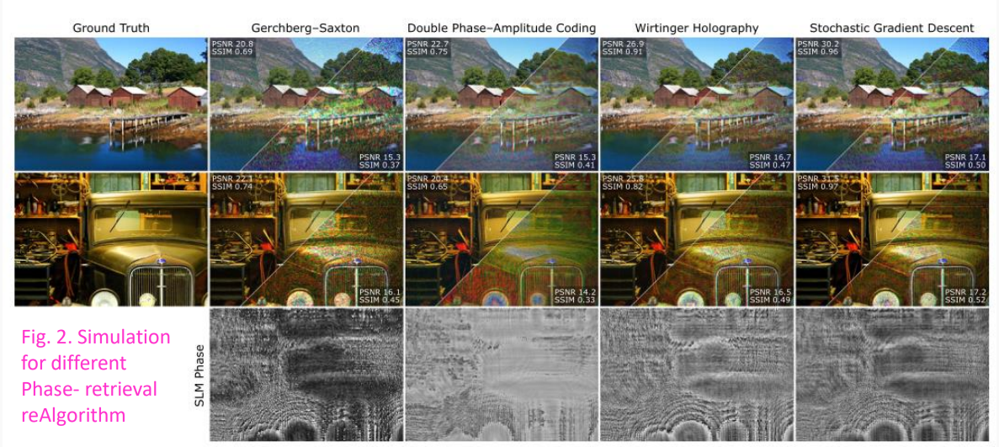
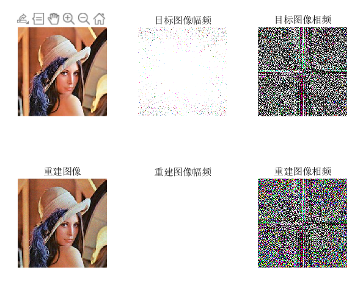

# GSA算法的实现与总结

## 实验内容

- Gerchberg-Saxton算法的实现
- 讨论该算法的内涵
- 讨论计算全息

## 实验结果

- 灰度图和RGB图像重建效果如下图所示：


## 讨论结果

- 为什么RGB图像的重建效果这么差，明明看到其他论文中复现该算法时，效果还不错？加了如下代码：

  ```matlab
      reconstruction = power(abs(fft2(slm_c)), 2);
      imshow(reconstruction./max(max(reconstruction)));	% no mat2gray
  ```






- 算法基于夫琅禾费衍射实现，因为在考虑SLM平面和像平面时二者之间互为傅里叶变换的关系。那么如果使用角谱法或者菲涅尔衍射会是什么样的效果？
- 使用一些图片重建标准：SSIM，并且实现一些其他算法来进行对比。

## 代码

```matlab
clc; clear all; close all;
% based on franuhofer diffraction

img = im2double((imread("lena.jfif")));
img_a = sqrt(img);
disp(class(img));
disp(size(img));
 
% 从slm平面开始
slm_a = 1;
slm_p = rand()*2*pi;
slm_c = img_a.*exp(1i*slm_p);

for i = 1:100
    % In the image plane, we use the target amplitude
    img_c = fft2(slm_c);
    img_c = img_c./abs(img_c).*img_a; 
    
    % In the slm plane, we use constant amplitude 1 (or gaussian beam
    % amplitude)
    slm_c = ifft2(img_c);
    slm_c = slm_c./abs(slm_c);
    
    % show the orignal target image intensity and its frequency domain
    figure(1);
    subplot(2, 3, 1);
    imshow(img);
    title("目标图像");
    subplot(2, 3, 2);
    imshow(log(1+abs(fftshift(fft2(img)))), []);
    title("目标图像幅频");
    subplot(2, 3, 3);
    imshow(angle(fftshift(fft2(img))));
    title("目标图像相频");

    % show the reconstruction image intensity and its frequency domain
    subplot(2, 3, 4);
    reconstruction = power(abs(fft2(slm_c)), 2);
    imshow(reconstruction./max(max(reconstruction)));
    title("重建图像");
    subplot(2, 3, 5);
    imshow(log(1+abs(fftshift(fft2(reconstruction)))), []);
    title("重建图像幅频");
    subplot(2, 3, 6);
    imshow(angle(fftshift(fft2(reconstruction))));
    title("重建图像相频");
end
```

